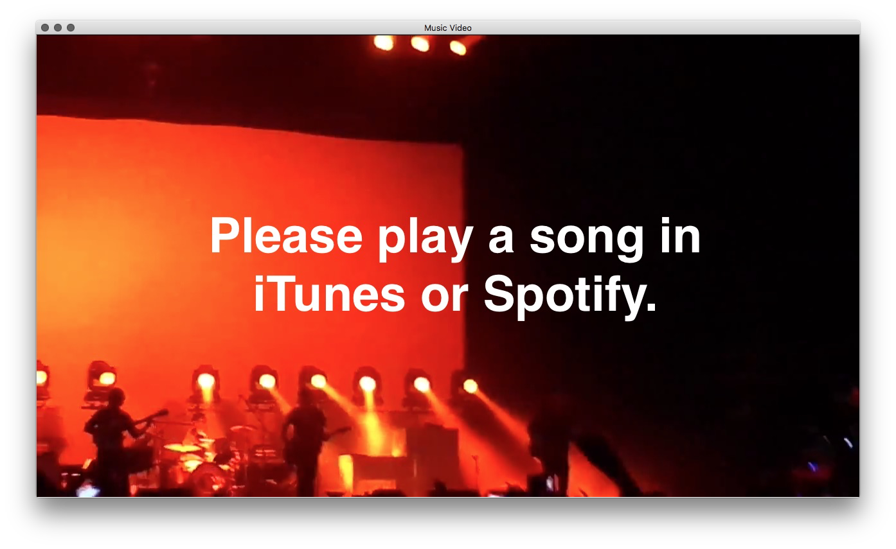

# Music Video
An OSX app that plays the first youtube video that matches the current iTunes/Spotify song. [Download](https://github.com/yene/Spotify-Video/releases/download/1.3/Music.Video.app.zip)

## Setup
* Install dependencies `carthage update --platform Mac`

## Credits
* [Iconic](https://useiconic.com/) for the awesome icon.
* It uses [Sparkle for Github](https://github.com/yene/Sparkle-for-Github) to update.
* It uses [youtube-302](https://github.com/yene/youtube-302) to get the matching youtube video.

## How to release an update
A quick guide for me:

1. Increase *Version* number under General
2. Commit all files
3. Push master to Github
4. In Xcode archive Version and Export a Developer ID-signed Application
5. Zip the exported application
6. On github create a new release with the same version
7. Test update

The *Build* version does not matter.

## Todo
* add progress indicator and go blank between loading videos -> maybe fade to black
* test with spotify free and the ads
* remove the small border around the imageview
* set the view background to black

## Getting Spotify and iTunes bridge headers
* `sdef /Applications/iTunes.app | sdp -fh --basename iTunes`

# Interaction with music players

## Notes on interaction with Shazam
Shazam does not publish the current song to notification. Report this to the devs. -> send bug report

## Notes on interaction with iTunes
iTunes does not publish the current "Playback Position" when the song gets paused/played. -> send bug report

## Notes on interaction with Spotify
* Only sends notification when sound changes, play, pause.
* Does not send notification when a looping track ends. -> send bug report
